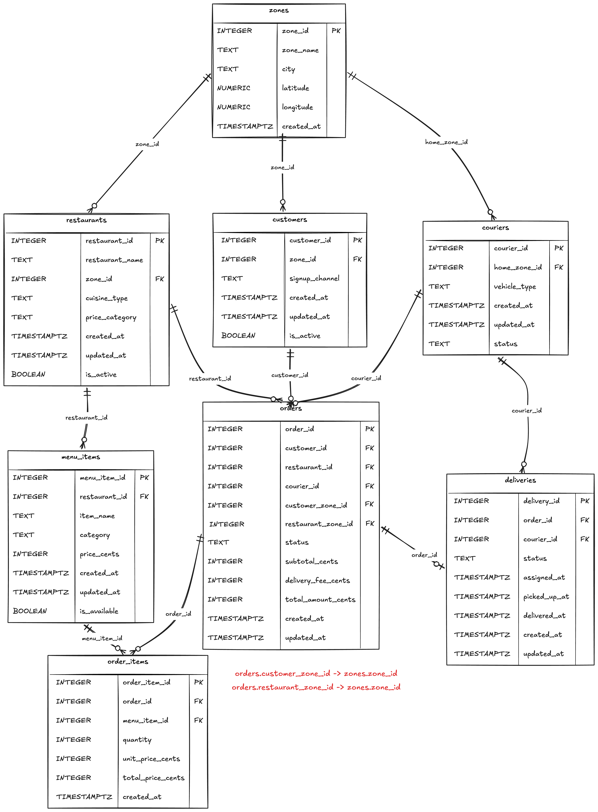

# Operational PostgreSQL Schema

This diagram shows the normalized OLTP schema used by the simulated food-delivery application.

PostgreSQL represents current operational state. Analytical star-schema models will be built later in ClickHouse/dbt.

Notes:
- `orders.customer_zone_id` and `orders.restaurant_zone_id` reference `zones.zone_id`.
- These zone fields are snapshots captured at order time.
- `orders.courier_id` is nullable because an order may exist before a courier is assigned.